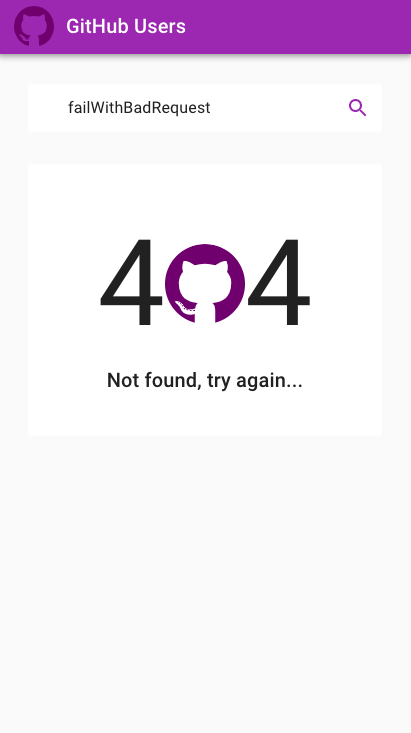

# GitHub Users

A playground project about searching a GitHub user by username, in order to practice **Redux pattern**. This application consumes the [public GitHub REST API](https://docs.github.com/en/rest/guides/getting-started-with-the-rest-api), so user doesn't have to be authenticated. After a successful search, the main page renders a user's minimal bio, their public repositories, followers and following users. Fully responsive layout taking advantage of Material Design specification.

## Built with

- [React.js](https://reactjs.org/) as main UI library
- [Redux](https://redux.js.org/) as state management library
- [Redux Thunk](https://github.com/reduxjs/redux-thunk) as side effects middleware
- [Material-UI](https://material-ui.com/) components as an implementation of [Google's Material Design](https://material.io/design)
- [axios](https://github.com/axios/axios) as HTTP client

## Code Style

- [Prettier](https://prettier.io/)
- [ESLint](https://eslint.org/)
- [Airbnb JavaScript Style Guide](https://github.com/airbnb/javascript)

## Initialization

This project was bootstrapped with [Create React App](https://github.com/facebookincubator/create-react-app) using the following command:

```console
$ npx create-react-app <project-name>
```

## Demo

[Netlify](https://www.netlify.com/) is used for automated build and production deployment. Check out the [deployed app](https://elenamountz-github-users.netlify.app//).

# App Screenshots

### Web

<table>
  <tr>
    <td></td>
    <td></td>
  </tr>
</table>

### Mobile

<table>
  <tr>
    <td></td>
    <td></td>
  </tr>
</table>


# Quick Start

## Prerequisites

Create a `.env` file at project's root directory, running the following command:

```console
$ touch .env
```


Define needed project environment variables as key/value pairs inside `.env` file. Notice that custom environment variables needs to start with ```REACT_APP``` prefix, so React can expose them in JS through ```process.env```.

Example:

```
REACT_APP_KEY = VALUE
```

Only one environment variable is required for this application, the GitHub API base URL. So, you need to define the following pair:

```
REACT_APP_BASE_URL = https://api.github.com
```

## Install depndencies

Before starting the server, install all the needed dependencies for the project, running the following command:

```console
$ npm install
```

## Run dev server

Run the appplication in the development mode using your terminal at project's root directory:

```console
$ npm start
```

Open [http://localhost:3000](http://localhost:3000) to view it in the browser.

## Build project

Build the app for production to the `build` folder using:

```console
$ npm run build
```

It correctly bundles React in production mode and optimizes the build for the best performance.

The build is minified and the filenames include the hashes.\
Your app is ready to be deployed!

See the section about [deployment](https://facebook.github.io/create-react-app/docs/deployment) for more information.

# License

This project is licensed under the terms of the MIT license. Check [LICENSE](LICENSE) file.